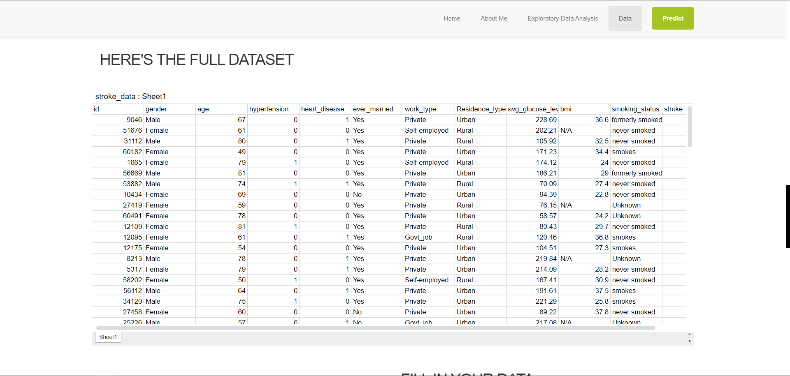

# Final-Project-Stroke
A Final Project for Purwadhika Data Scientist Course

This Repository is about exploring and predicting red wine quality. The dataset used in this project can be found here

The dataset consist of 11 input variables based on physicochmical analysis of red wines and 1 output variable.

The input variables are:

1) id: unique identifier
2) gender: "Male", "Female" or "Other"
3) age: age of the patient
4) hypertension: 0 if the patient doesn't have hypertension, 1 if the patient has hypertension
5) heart_disease: 0 if the patient doesn't have any heart diseases, 1 if the patient has a heart disease
6) ever_married: "No" or "Yes"
7) work_type: "children", "Govt_jov", "Never_worked", "Private" or "Self-employed"
8) Residence_type: "Rural" or "Urban"
9) avg_glucose_level: average glucose level in blood
10) bmi: body mass index
11) smoking_status: "formerly smoked", "never smoked", "smokes" or "Unknown"*
12) stroke: 1 if the patient had a stroke or 0 if not
*Note: "Unknown" in smoking_status means that the information is unavailable for this patient

The steps that I took for this predictions were:

Exploratory data analysis
Preprocessing. Which mainly about handling missing values
Model selections. The models used are Logistic Regression, DecisionTreeClassifier, and KNNeighbors
Deployment with flask.
The best model evaluation is Logistic Regression.
Robust Scaling nor Polynomial does any improvement to the model

I did Hyperparameter tunning, with result as the following:

{'C': 0.1, 'solver': Newton-cg}

The tunning results improved the model to Recall Score of 0.88

